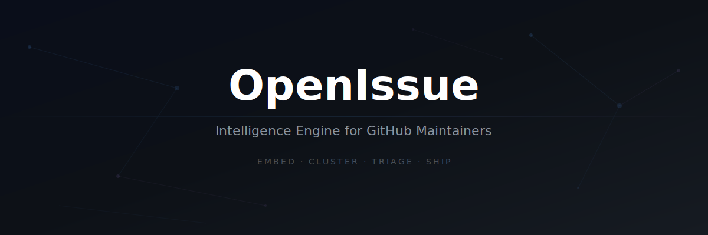

<p align="center">
  
</p>

<h1 align="center">OpenIssue</h1>

<p align="center">
  <strong>The Intelligence Engine That Gives Open-Source Maintainers Their Mornings Back</strong>
</p>

<p align="center">
  Ingest, vectorize, cluster, and search your GitHub issues — <em>semantically</em>.
</p>

<p align="center">
  <a href="#-quickstart"></a>
  <a href="#"></a>
  <a href="#"></a>
  <a href="#"></a>
  <a href="#"></a>
</p>

<p align="center">
  <a href="docs/01_frontend.md">Frontend Docs</a> · 
  <a href="docs/02_backend.md">Backend Docs</a> · 
  <a href="docs/03_api.md">API Reference</a> · 
  <a href="docs/04_routing.md">Routing</a> · 
  <a href="docs/05_middleware.md">Middleware</a> · 
  <a href="docs/06_security.md">Security</a> · 
  <a href="docs/07_open_source.md">Contributing</a>
</p>

---

## The Problem

You maintain a popular open-source project. Every morning, you open GitHub and see 14 new issues. Three are duplicates — but worded differently. Two describe the same root cause from different angles. One is a critical regression buried under cosmetic complaints.

**You spend an hour triaging before writing a single line of code.**

GitHub search is keyword-based. Labels require manual effort. Stale bots just close old issues. None of these tools *understand* your issues.

## The Solution

OpenIssue embeds every issue in your repository into a 384-dimensional vector space, clusters semantically similar issues with DBSCAN, and presents them as actionable intelligence — in real time.

```
14 new issues overnight
      ↓ OpenIssue
3 clusters: "hydration errors" (5 issues), "devtools crash" (4 issues), "CSS specificity" (3 issues)
2 noise: unrelated feature requests
      ↓
You read 3 cluster summaries instead of 14 individual issues.
Morning triage: 5 minutes instead of 60.
```

---

## ✨ Features

### 🧠 Semantic Intelligence
Not keyword matching — actual meaning. "SSR content mismatch" and "hydration error on server render" are recognized as the same problem because their embedding vectors are 0.28 cosine distance apart.

### ⚡ Real-Time Streaming
Cluster results stream to your browser via Server-Sent Events as they're computed. You see the first cluster in under 2 seconds. No spinner, no "please wait" — the intelligence materializes in front of you.

### 🔍 AI-Powered Search
Ask a question in plain English:  
> *"Why do hydration errors happen with server-side rendering?"*

Get an answer synthesized by Gemma 4, **citing your actual issue numbers**:  
> *"As seen in Issue #18790, hydration errors occur when server-rendered HTML does not match..."*

### 🗺️ Spatial Matrix
A Canvas-rendered 2D PCA projection of your entire vector space. See clusters as territories. Hover for issue details. Zoom into dense regions. Understand your issue landscape at a glance.

### 📊 Vector Index Telemetry
FAISS index health dashboard: coverage ring, pairwise similarity distribution, cluster breakdown table, embedding model info, disk usage. The operational dashboard your vector pipeline deserves.

### 🏷️ Maintainer Triage Tools
Priority levels (P0–P3), bookmarks, pins, linked PRs, freetext notes — all stored locally, never touching GitHub. Your annotations, your way.

### 🔐 Runs Entirely Offline
No cloud. No SaaS. No API costs for embeddings. The MiniLM model runs on your CPU. Only Groq (optional, free tier) is external — and the system works without it.

---

## 🖥️ Screenshots

<p align="center">
  
  <br>
  <em>Intelligence Dashboard — 550 neural clusters from 1,902 facebook/react issues, streamed in real time</em>
</p>

---

## 🏗️ Architecture

```
┌──────────────────────────────────────────────────────────────────────┐
│                         BROWSER (React 18)                          │
│                                                                      │
│  Landing → Login → RepoSelect → Dashboard ← SSE Stream              │
│                                    │         ← WebSocket Feed        │
│                    ┌───────────────┼────────────────┐                │
│              Spatial Matrix    Vector Index    Issue Detail           │
└──────────────────────────────────────────────────────────────────────┘
                              │ fetch() │
                              ▼         ▼
┌──────────────────────────────────────────────────────────────────────┐
│                     FastAPI (Python 3.11+)                           │
│                                                                      │
│  ┌─────────┐  ┌──────────┐  ┌──────────┐  ┌──────────┐             │
│  │ GitHub   │  │ Embedding│  │ FAISS    │  │ DBSCAN   │             │
│  │ Crawler  │→ │ (MiniLM) │→ │ IndexIP  │→ │ Cluster  │             │
│  └─────────┘  └──────────┘  └──────────┘  └──────────┘             │
│       │                                         │                    │
│       │              ┌──────────┐               │                    │
│       └─────────────→│ SQLite   │←──────────────┘                    │
│                      │ (WAL)    │                                    │
│                      └──────────┘                                    │
│                           │                                          │
│                    ┌──────┴──────┐                                    │
│                    │ Groq API    │                                    │
│                    │ (Gemma 4)   │                                    │
│                    └─────────────┘                                    │
└──────────────────────────────────────────────────────────────────────┘
```

| Layer | Technology | Purpose |
|---|---|---|
| **Frontend** | React 18 + Vite | Dark-mode SPA, Canvas visualizations, SSE consumer |
| **API** | FastAPI + Uvicorn | 20 endpoints: sync, search, triage, proxy, telemetry |
| **Embedding** | all-MiniLM-L6-v2 | 384-dim dense vectors, L2-normalized, offline |
| **Index** | FAISS IndexFlatIP | Exact cosine similarity search, atomic persistence |
| **Clustering** | DBSCAN (cosine) | Density-based grouping, no predetermined cluster count |
| **LLM** | Groq Gemma 4 | Cluster insights + semantic search synthesis |
| **Storage** | SQLite (WAL mode) | Issues, clusters, triage, sync state |
| **Streaming** | SSE + WebSocket | Real-time cluster delivery + sync progress |

---

## 🚀 Quickstart

### Prerequisites

- Python 3.11+ &nbsp;·&nbsp; Node.js 18+ &nbsp;·&nbsp; npm 9+

### 1. Clone & Setup

```bash
git clone https://github.com/parvarh26/ForgeX.git
cd ForgeX

# Backend
cd backend
python3 -m venv venv
source venv/bin/activate
pip install -r requirements.txt

# Environment
cat > .env << 'EOF'
GROQ_API_KEY=gsk_your_key_here
GITHUB_TOKEN=github_pat_your_token_here
EOF

# Frontend
cd ../frontend
npm install
cd ..
```

### 2. Launch

```bash
./start-all.sh
```

### 3. Use

1. Open **http://localhost:5173**
2. Click "Sign in with GitHub" → enter any token (or skip)
3. Enter a repo: `facebook/react`
4. Watch clusters stream in real time

That's it. No Docker. No database setup. No cloud accounts required.

---

## 🔑 API Keys

| Key | Required? | Free Tier | Get It |
|---|---|---|---|
| **GITHUB_TOKEN** | Recommended | 5,000 req/hr (vs 60 without) | [github.com/settings/tokens](https://github.com/settings/tokens) |
| **GROQ_API_KEY** | Optional | 14,400 req/day | [console.groq.com](https://console.groq.com) |

**Without Groq:** Cluster insights use keyword extraction instead of LLM. Everything else works perfectly.

**Without GitHub token:** Works, but large repos (>300 issues) will hit the 60 req/hr rate limit during sync.

---

## 📡 API Overview

20 endpoints across 5 routers. Full reference: [docs/03_api.md](docs/03_api.md)

| Endpoint | Method | What It Does |
|---|---|---|
| `/health` | GET | Liveness check |
| `/api/v1/github/sync` | POST | Start sync + SSE stream of clusters |
| `/api/v1/github/cluster/{id}` | GET | Single cluster with all issues |
| `/api/v1/github/issue/{number}` | GET | Live issue detail from GitHub API |
| `/api/v1/github/triage/{number}` | GET/PATCH | Maintainer annotations (priority, notes) |
| `/api/v1/github/spatial` | GET | PCA 2D projection for visualization |
| `/api/v1/github/vector-stats` | GET | FAISS index telemetry dashboard |
| `/api/v1/ai/search` | POST | Semantic search with LLM synthesis |
| `/api/v1/system/status` | GET | CPU, RAM, DB stats |
| `/api/v1/github/ws/sync/{repo}` | WS | Real-time sync progress feed |

**Interactive docs:** `http://localhost:8000/docs` (Swagger UI)

---

## 📖 Documentation

Seven-part comprehensive documentation covering every layer of the system:

| # | Document | Lines | Description |
|---|---|---|---|
| 01 | [Frontend](docs/01_frontend.md) | 372 | React components, routing, state management, SSE/WS patterns |
| 02 | [Backend](docs/02_backend.md) | 673 | AI services, database schema, intelligence pipeline |
| 03 | [API Reference](docs/03_api.md) | 1,185 | Every endpoint with request/response schemas and curl examples |
| 04 | [Routing](docs/04_routing.md) | 325 | Client + server routing, navigation flows, data flow diagrams |
| 05 | [Middleware](docs/05_middleware.md) | 398 | CORS, exception handlers, startup recovery, implicit layers |
| 06 | [Security](docs/06_security.md) | 495 | Threat model, SSRF/SQLi/XSS analysis, hardening checklist |
| 07 | [Open Source](docs/07_open_source.md) | 422 | Architecture rationale, contributing guide, roadmap |

**Total: 3,870 lines of documentation.**

---

## 🧪 Tech Stack

<table>
<tr>
<td width="50%" valign="top">

### Frontend
- **React 18** — Functional components, hooks only
- **Vite 5** — HMR dev server, fast builds
- **React Router v6** — Client-side routing
- **Canvas 2D API** — Spatial matrix rendering (no chart library)
- **react-markdown** — GitHub Flavored Markdown
- **lucide-react** — Icon set

</td>
<td width="50%" valign="top">

### Backend
- **FastAPI** — Async Python API framework
- **SQLite** — WAL mode, zero-config persistence
- **FAISS** — Facebook AI Similarity Search
- **SentenceTransformers** — MiniLM-L6-v2 (384d)
- **scikit-learn** — DBSCAN clustering
- **Groq API** — Gemma 4 LLM for insights
- **httpx** — Async HTTP client

</td>
</tr>
</table>

---

## 🔒 Security

OpenIssue is designed for **localhost use**. There is no authentication. See the full [Security Documentation](docs/06_security.md) before deploying to any network.

**Key points:**
- ✅ SQL injection protected (SQLAlchemy ORM, parameterized queries)
- ✅ XSS protected (React default escaping, no `dangerouslySetInnerHTML`)
- ✅ SSRF partially protected (URL prefix validation on proxy endpoints)
- ✅ Error messages never leak internals
- ⚠️ No authentication or authorization
- ⚠️ Uvicorn binds to `0.0.0.0` (LAN-accessible) — change to `127.0.0.1` for strict localhost

---

## 🗺️ Roadmap

- [x] Semantic clustering with DBSCAN
- [x] Real-time SSE streaming pipeline
- [x] FAISS atomic persistence with integrity checks
- [x] AI semantic search with Groq Gemma 4
- [x] Spatial matrix Canvas visualization
- [x] Maintainer triage tools (P0-P3, bookmarks, notes)
- [x] Small repo graceful degradation
- [ ] Integration test suite
- [ ] GitHub Action for auto-commenting duplicate links
- [ ] OAuth login flow
- [ ] HDBSCAN for improved clustering
- [ ] PostgreSQL migration for multi-instance deployment
- [ ] Kubernetes Helm chart

---

## 🤝 Contributing

We welcome contributions! See the [Contributing Guide](docs/07_open_source.md#contributing-guide) for code style, patterns, and how to add endpoints/pages/AI services.

```bash
# Quick dev loop
./start-all.sh          # Backend + Frontend, hot-reload
# Edit code → changes apply automatically
# Backend logs: tail -f backend.log
# Frontend logs: tail -f frontend.log
```

---

## 📄 License

MIT

---

<p align="center">
  <sub>Built by developers who got tired of spending their mornings on triage instead of code.</sub>
</p>
